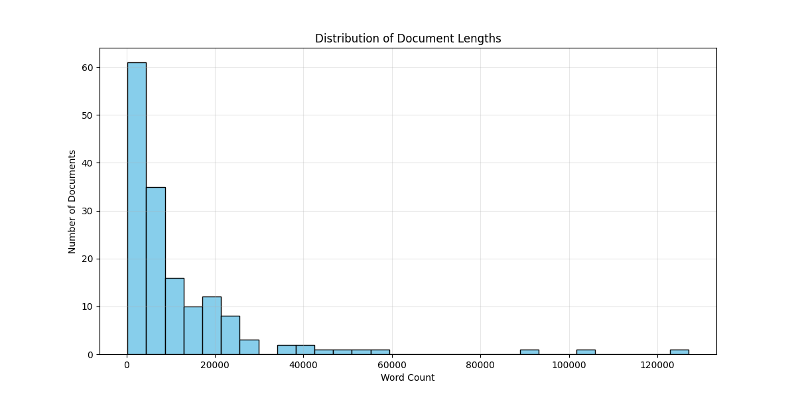
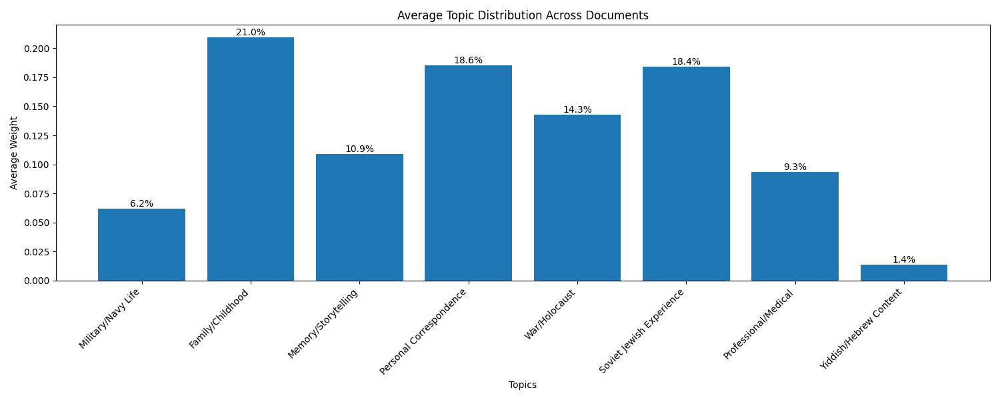
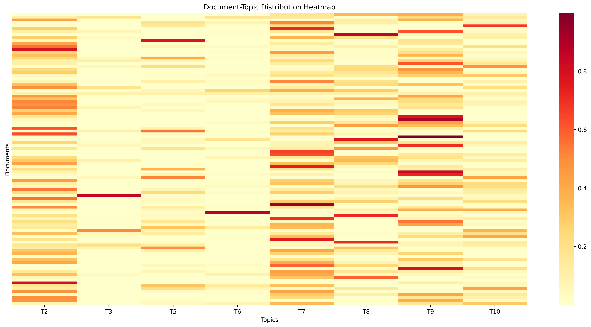

# Detailed Analysis of Soviet Jewish Memoirs Corpus

## 1. Dataset Overview

The corpus consists of 156 memoir texts in Russian language, containing autobiographical narratives of Soviet Jews. These texts represent a diverse collection of personal accounts, family histories, and historical documentation.

### 1.1 Basic Statistics

- Total number of documents: 156
- Average document length: 11,875 words
- Median document length: 5,950 words
- Length range: 262 to 127,012 words
- Standard deviation: 17,399 words

The box plot reveals that different types of narratives tend toward different lengths, with military memoirs and family histories typically being longer than personal correspondence or professional accounts.

## 2. Topic Analysis

Using Latent Dirichlet Allocation (LDA), we identified 8 distinct topics. The distribution of these topics across the corpus reveals the multifaceted nature of Soviet Jewish experiences.

### 2.2 Detailed Topic Analysis

#### Topic 1: Military/Navy Life (6.17%)

**Key Words:**

* командир: 809.058
* корабль: 746.084
* офицер: 693.280
* служба: 538.587
* начальник: 531.516
* солдат: 516.613
* военный: 472.490
* затем: 444.805
* довольно: 422.674
* крейсер: 339.010
* станция: 324.672
* батальон: 297.809
* училище: 289.817

**Context Examples:**

* командир: ...Так что встряска для меня — командира БЧ-5 (электромеханической боевой части крейсера), в чьем веден...
* корабль: ...Учебный корабль "Комсомолец" был построен в 1903г...
* офицер: ...Вспоминая прожитые годы, могу отметить, что довольно успешно находил контакты с окружающими и в детс...
* служба: ...И началась моя служба на минзаге...
* начальник: ...стал начальником особого отдела воинского подразделения (видимо, полка или бригады), расквартированн...
* командир: ...Не помню, как наши командиры навели порядок...
* корабль: ...Пробыли в Николаевске мы два или три дня, затем загрузились на корабль и по Японскому морю отплыли н...
* офицер: ...Так шла наша жизнь в июле и августе 1941 года … Митинги, запись добровольцев, подвиги наших солдат и...
* служба: ...Пробыв до утра на Московском вокзале, я сел на поезд до станции Волхов и прибыл в воинскую часть 832...
* начальник: ...Помню еще, как у правления колхоза стояло несколько верховых лошадей – приехали в колхоз начальники ...
* командир: ...Вернувшись из командировки во второй декаде июня после успешно выполненного задания, я включился в с...
* начальник: ...О боевых действиях этих Армий уже написаны обширные мемуары видными военачальниками, да и не мне, ря...

#### Topic 2: Family/Childhood (20.96%)

**Key Words:**

* папа: 2079.065
* бабушка: 1275.359
* тётя: 890.032
* комната: 810.437
* дядя: 796.834
* класс: 685.888
* дедушка: 611.505
* ленинград: 471.508
* любить: 330.895
* девочка: 322.205
* дед: 302.740
* купить: 285.930
* родственник: 285.886
* завод: 281.761
* красивый: 275.080

**Context Examples:**

* папа: ...Папа отправлял своих знакомых со словами: «У меня в Москве есть сестра, она обязательно вас примeт»...
* бабушка: ...Шейна (1877–1942) – моя бабушка, вышла замуж за дедушку Гейселя Великовского (1870–1942) в 16 лет...
* тётя: ...Тётя Роза родилась в 1903 году – старшая папина сестра...
* комната: ...Комната на земле – 12 кв...
* дядя: ...Дядя Яша ушел в 1968 г...

## Topic 3: Memory/Storytelling

**Key Words:**

* книга: 485.377
* любить: 454.021
* рассказывать: 285.397
* стих: 278.674
* история: 268.667
* народ: 267.236
* мир: 263.348
* глаз: 259.323
* правда: 259.099
* конечно: 256.135
* память: 251.581
* театр: 242.922
* страна: 231.840
* детство: 228.817
* многие: 225.895

**Context Examples:**

* книга: ...Дед больше сидел за священными книгами и ходил в синагогу, говоря по-французски: «Оревуар», а приход...
* рассказывать: ...Возможно с них брали подписку, что они ничего не будут рассказывать...
* стих: ...Но это, в какой-то мере, кредо поэта, который каждый свой день соизмерял стихами, какие он написал и...
* книга: ...В моей библиотеке хранится одна книга из красиво изданного собрания сочинений А...
* любить: ...Уезжали навсегда! Но она не переставали любить и мечтать, через случайные каналы узнавали о жизни др...
* рассказывать: ...Более доброго, чистого и преданного человека я не знаю, о ней можно рассказывать бесконечно...
* стих: ...Если я какое-нибудь стихотворение не могла выучить, говорила «Доченька, положи книжку под подушку, н...
* история: ...А сколько интересных людей и событий видело зеркало за эти годы! Для меня это история...

## Topic 4: Personal Correspondence

**Key Words:**

* ты: 1207.069
* письмо: 604.024
* ведь: 534.615
* тут: 495.990
* почему: 483.386
* папа: 449.513
* конечно: 446.590
* совсем: 430.677
* ехать: 419.868
* голова: 418.470
* твой: 385.317
* деньга: 385.250
* понять: 381.095
* вдруг: 379.673
* понимать: 368.245

**Context Examples:**

* ты: ...Пока я не еду к Мотлу, я рассчитываю, что 25-го вечером я должна ехать к Мотлу...
* письмо: ...Мусенька заглядывает в письмо...
* ведь: ...Пока мои глаза открыты, я ведь остаюсь как все животные...
* тут: ...Мои огурцы не растут, потому что у нас очень холодно, так что, может быть, добрый человек Шумский пр...
* почему: ...Почему ты не купишь себе еще курицу, ты сможешь есть и беречь внутренности...
* ты: ...Дорогой мой Авраам! Помню ли я тот вечер у Зины, когда я читала вслух, а ты слушал? Помню ли я? А чт...
* письмо: ...Письмо Ханы Шефтель к жениху Аврааму Кагана Киев, 30-го марта 1902 г...
* ведь: ...Ведь с Леей я помру от тоски, если она даже согласится...
* тут: ...- Не мудрствуй, отдайся своему чувству, доверься ему и живи, да и все тут, - шептало оно...
* почему: ...Я не знаю, почему тебе она не нравилась, мне она очень нравится...
* ты: ...Однажды в начале июня папа пришел с работы и сказал, что ему дали для меня путевку в пионерский лаге...
* ведь: ...Ведь ее могли арестовать как жену советского офицера...
* тут: ...Мы шептались о том, что, если нас здесь найдут, то наверняка тут и расстреляют...
* почему: ...Я часто думала, почему мы должны жить в таком страхе, почему у нас такая жизнь? Прошло какое-то врем...

## Topic 5: War/Holocaust

**Key Words:**

* немец: 330.326
* таня: 247.000
* синагога: 202.569
* могилёв: 199.010
* фронт: 198.676
* вагон: 190.009
* земля: 180.919
* хлеб: 176.759
* дядя: 175.173
* деревня: 172.076
* нога: 170.860
* вода: 169.914
* лес: 169.271
* путь: 168.307
* голова: 167.655

**Context Examples:**

* немец: ...А когда в этом районе оказалась немецкая часть, то в бою с ними погибло много людей...
* синагога: ...Правда, так было до 30-х годов, а потом, когда синагога закрылась, многое изменилось...
* фронт: ...Я участвовал в спускании под откос немецких эшелонов, в разведке, в разгроме немецко-полицейских гар...
* немец: ...Мы побежали посмотреть на это поближе и увидели немецких диверсантов, которые сворачивали парашюты и...
* таня: ...Нашим кормильцем была моя мама Таня...
* фронт: ...Отец вместе с агитбригадой на лошадке, а другой раз и пешком ходили по деревням, собирали теплую оде...

## Topic 6: Soviet Jewish Experience

**Key Words:**

* израиль: 773.836
* ссср: 493.355
* страна: 388.698
* народ: 365.537
* член: 293.517
* отношение: 263.295
* союз: 261.127
* власть: 248.655
* организация: 238.031
* кгб: 230.211
* затем: 223.035
* директор: 219.065
* ленинград: 218.863
* некоторый: 216.999
* случай: 216.839

**Context Examples:**

* израиль: ...Начало нашего долгого пути в Израиль Знакомство с методами и подвалами КГБ Отцовская ветвь нашей сем...
* ссср: ...Когда порой приходится слышать, что какая-то семья собирается покинуть СССР через год или два, мотив...
* страна: ...Во всех цивилизованных странах пенсионеру выплачивают пенсию до самой смерти, независимо о того, где...
* народ: ...Народный юмор называет их дважды и трижды евреями Советского Союза...
* член: ...Главный редактор, он же член ЦК КП Грузии очень на нас обиделся, как оказалось...
* израиль: ...Государство Израиль...
* ссср: ...Поскольку Саратов был глубоким тылом, то во время этой войны сюда прибыли евреи-беженцы опять-таки и...
* член: ...А вы как член партии обязаны были бы выполнить этот приказ...
* израиль: ...Короче говоря, внешне ничто не предвещало принятия нами решения переселиться в Израиль...
* ссср: ...Моя жизнь в значительной степени типична для многих евреев, проживавших на западных территориях, вош...
* народ: ...Наши общечеловеческие и общедемократические устремления стали уступать место все усиливающемуся пред...

## Topic 7: Professional/Medical

**Key Words:**

* врач: 344.291
* больной: 258.492
* партия: 216.391
* курс: 173.300
* гриша: 171.518
* веня: 162.230
* профессор: 159.540
* завод: 144.929
* гера: 139.010
* рабочий: 138.673
* операция: 135.069
* заведовать: 128.789
* научный: 127.671
* фронт: 124.913
* прийтись: 123.401

**Context Examples:**

* врач: ...Среди них Саша Брайловский, отправленный царской полицией [пропуск] сын врача, студент, избранный вп...
* больной: ...Благодаря тому, что медицинская помощь была оказана рано, больной выздоровел...
* партия: ...Ленин считал, что революцию надо продолжить, чтобы удалить от власти буржуазию с поддерживающими ее ...
* курс: ...В дальнейшем по мере приближения к освоению курса семи классов женской гимназии я получала более сол...
* гриша: ...Гришаковой, кот...
* партия: ...“Коммунистическая Партия - вдохновитель и организатор наших побед”...
* курс: ...Когда я должен был за одну смену изготовить 120—150 рецептов, я поневоле учился азбуке рациональной ...

## Topic 8: Yiddish/Hebrew Content

**Key Words:**

* דער: 164.010
* איז: 160.010
* און: 151.010
* אין: 138.010
* זיך: 131.010
* פון: 115.010
* מיט: 105.010
* бенора: 103.091
* געווען: 100.010
* איך: 97.010
* דעם: 93.010
* ניט: 82.010
* лошадь: 79.513
* алик: 67.874
* училище: 56.567

**Context Examples:**

* דער: ...ענדלעך האָט זיך דער עראָפּלאַן אָפּגעריסן פֿון דער רוסישער ערד, זיך אויפגעהויבן אין דער לופֿטן און ג...
* איז: ...ס׳איז געווען אַ לויטערער אַפּריל-טאָג (לויט ײדישן לוח סאַמע מיטן פסח) דער הימל איז געווען אַ זייערבל...

### 2.3 Topic Correlations

The correlation analysis reveals several interesting patterns:

1. **Strongest Negative Correlations:**

- Family/Childhood and Soviet Jewish Experience (-0.32):

  - This strong negative correlation suggests that when texts focus on family memories, they tend to have less content about Soviet institutional experiences
  - Might indicate a separation between personal/intimate narratives and institutional/political ones
- Personal Correspondence and Soviet Jewish Experience (-0.29):

  - Shows that personal letters tend to focus less on broader Soviet Jewish experiences
  - Suggests a distinction between private communication and public/institutional experiences
- Family/Childhood and Personal Correspondence (-0.23):

  - Interesting as both are personal narratives, but appear in different types of documents
  - Might reflect different writing styles and purposes

2. **Notable Weak or No Correlations:**

- Memory/Storytelling and Personal Correspondence (-0.0053):

  - Very weak correlation suggests these themes can coexist
  - Makes sense as personal letters often contain storytelling elements
- War/Holocaust and Military/Navy Life (0.012):

  - Surprisingly weak correlation despite both being war-related
  - Suggests these are distinct types of narratives (personal war experiences vs. military service)
- Yiddish/Hebrew Content shows consistently weak correlations with all topics:

  - Most correlations are between -0.03 and -0.1
  - Suggests these sections appear independently of other themes

This matrix suggests that:

- The memoirs tend to maintain distinct focuses rather than mixing all themes equally
- There's a clear separation between institutional/public and personal/private narratives
- Language choice (Yiddish/Hebrew vs Russian) operates independently of thematic content

## 3. Document-Topic Distribution

This Document-Topic Distribution Heatmap shows how topics are distributed across all documents in our corpus.

1. Topic Mixing:

   - Most documents (rows) show multiple colored bands, indicating they contain multiple topics
   - The intensity of the color (from light yellow to dark red) shows how strongly each topic is present
   - Very few documents are dominated by a single topic (would appear as a single dark red band)
2. Topic Prominence:

   - Family/Childhood (second column) shows consistently strong presence (more red/orange bands)
   - Soviet Jewish Experience and Personal Correspondence also show strong presence across many documents
   - Yiddish/Hebrew Content (last column) appears rarely but when it does, it's often very strong (dark red)
3. Topic Co-occurrence:

   - We can see patterns of topics that frequently appear together (adjacent columns with similar intensities)
   - Some documents show clear transitions between topics (varying intensities across the row)
   - Military/Navy Life (first column) appears less frequently but often with high intensity when it does
4. Document Structure:

   - The varied patterns suggest these memoirs are complex narratives that weave together multiple themes
   - Some documents focus more strongly on 2-3 topics while others spread more evenly across topics
   - There's significant variation in how authors structure their narratives

This visualization confirms that:

- Soviet Jewish memoirs are typically multi-themed rather than single-topic narratives
- There are common patterns in how topics combine
- Different authors take different approaches to structuring their memories and experiences

#### 3.1 Mixed Topic Documents

The analysis reveals a complex pattern of topic distribution across the corpus. Of the 156 documents:

- 78 documents (50%) contain two significant topics
- 30 documents (19.2%) contain three significant topics
- 45 documents (28.8%) are single-topic
- Only 1 document contains four topics
- 2 documents show no significant topic dominance

The most frequent topic combinations are:

1. Family/Childhood + Personal Correspondence (10 documents)
2. Memory/Storytelling + Soviet Jewish Experience (8 documents)
3. Family/Childhood + War/Holocaust (8 documents)
4. Personal Correspondence + Soviet Jewish Experience (6 documents)
5. Family/Childhood + Soviet Jewish Experience (6 documents)

When topics appear significantly in documents, they show different levels of dominance:

- Yiddish/Hebrew Content shows the highest average weight (0.557) when present
- Family/Childhood (0.432), Soviet Jewish Experience (0.428), and Professional/Medical (0.427) show similar moderate weights
- Memory/Storytelling (0.330) and Military/Navy Life (0.347) show lower average weights

#### 3.2 Single-Topic Documents

45 documents (28.8% of the corpus) show strong alignment with a single topic. The distribution is:

- Family/Childhood: 15 documents
- Personal Correspondence: 11 documents
- Soviet Jewish Experience: 8 documents
- War/Holocaust: 5 documents
- Professional/Medical: 3 documents
- Memory/Storytelling, Military/Navy Life, and Yiddish/Hebrew Content: 1 document each

This distribution suggests that:

1. Family narratives are most likely to stand alone as complete accounts
2. Personal correspondence often maintains a focused narrative
3. Soviet Jewish Experience accounts can be either focused or integrated with other themes
4. Most military, literary, and Yiddish/Hebrew content typically appears in combination with other topics

The analysis reveals that while Soviet Jewish memoirs typically weave together multiple aspects of life experiences, about a third maintain a focused thematic approach, particularly when dealing with family histories or personal correspondence.

## 4. Language and Style Analysis

- Predominant Russian narrative
- Hebrew/Yiddish sections (1.39% of content)
- Occasional transliterated terms

## 5. Methodology Notes

### 5.1 Text Processing

- Russian language-specific preprocessing
- Hebrew/Yiddish character preservation
- Named entity handling

### 5.2 Topic Modeling

- LDA parameters: alpha=0.1, 8 topics
- Document-topic prior optimization
- Cross-validation for topic number selection
