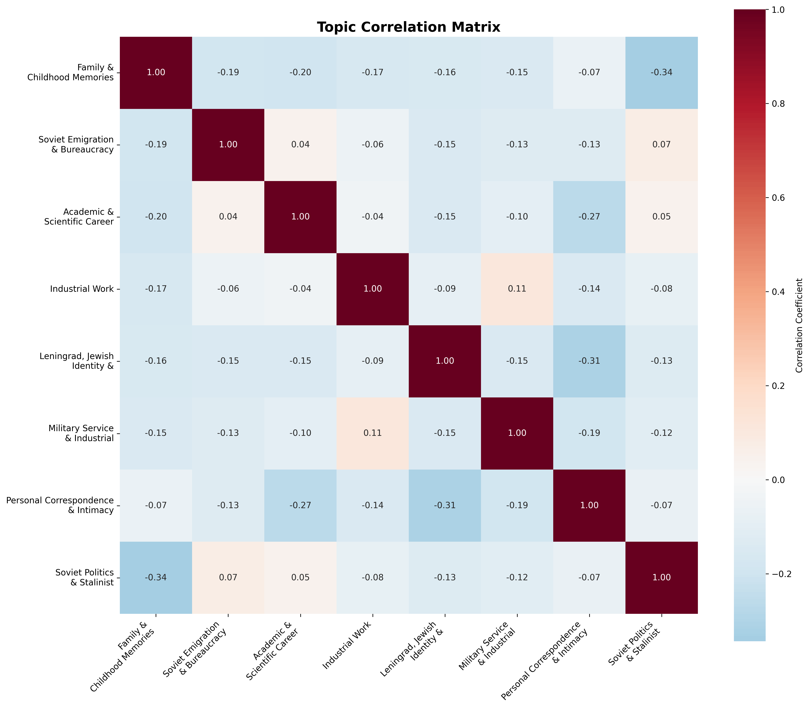

# Detailed Analysis of Soviet Jewish Memoirs Corpus

## 1. Dataset Overview

The corpus consists of 183 memoir texts in Russian language, containing autobiographical narratives of Soviet Jews. These texts represent a diverse collection of personal accounts, family histories, and historical documentation.

## 2. Topic Analysis

Using Latent Dirichlet Allocation (LDA), we identified 8 distinct topics. The distribution of these topics across the corpus reveals the multifaceted nature of Soviet Jewish experiences.

### 2.1 Topic Correlations

The correlation analysis reveals several interesting patterns:

1. **Strong Negative Correlations (Dark Blue, -0.3+):**

- Family & Childhood Memories ↔ Soviet Politics & Stalinist Era (-0.34): This suggests documents focus on either personal/family narratives OR political discourse, but rarely both together. Personal stories tend to avoid explicit political commentary.
- Personal Correspondence & Intimacy ↔ Leningrad, Jewish Identity & Memory (-0.31): Intimate personal letters appear distinct from broader cultural/geographical identity narratives.

2. **Topic Isolation Patterns:**

- Family & Childhood Memories shows negative correlations with most topics (-0.15 to -0.34), suggesting these personal narratives are quite distinct and self-contained.
- Personal Correspondence & Intimacy is similarly isolated, indicating intimate communications form a separate discourse from other themes.

3. **Weak Positive Associations**:

- Industrial Work ↔ Military Service & Industrial Leadership (0.11): These professional/institutional contexts sometimes overlap, which makes sense as both involve hierarchical structures and leadership roles.
- Soviet Emigration & Bureaucracy ↔ Soviet Politics & Stalinist Era (0.07): Slight positive correlation suggests emigration narratives sometimes touch on broader political themes.

This pattern suggests the document collection contains distinct narrative types:

- Personal/Intimate Domain: Family memories and personal correspondence form separate, self-contained narratives
- Professional/Public Domain: Work, military, and academic topics show some interconnection
- Political/Historical Domain: Emigration and Soviet politics occasionally intersect

This suggests the corpus might contain oral histories or memoirs where individuals compartmentalize different aspects of their experiences - personal life, professional life, and political experiences are discussed as distinct themes rather than integrated narratives.

## 3. Document-Topic Distribution

### 3.1. Highly Focused Documents

The heatmap reveals **dark red horizontal bands** (high topic weights) indicating documents that are strongly focused on single topics:

- **T7 (Leningrad, Jewish Identity & Memory)**: Several documents with very strong focus
- **T9 (Personal Correspondence & Intimacy)**: Some documents are almost purely letters/intimate content
- **T2 (Family & Childhood Memories)**: Some highly focused family narratives

### 3.2. Mixed-Topic Documents

Many documents show **multiple moderate-intensity colors** across several topics, suggesting:

- **Oral histories or interviews** that cover multiple life aspects
- **Biographical narratives** that weave together personal, professional, and cultural themes

### 3.3. Sparse Topic Confirmation

The heatmap confirms earlier findings about topic distribution:

- **T3 (Soviet Emigration & Bureaucracy)** and **T6 (Industrial Work)** show mostly pale yellow/white, confirming they're rare
- These appear in very few documents and with low intensity

## 4. Corpus Structure Insights

### 4.1 Document Clustering Potential

Vertical patterns in the heatmap suggest potential document clusters:

- Some documents focus heavily on **personal themes** (T2, T7, T9)
- Others have more **balanced distributions** across multiple topics
- Some seem to emphasize **professional/institutional** themes (T5, T8, T10)

### 4.2 Topic Exclusivity vs. Co-occurrence

The pattern supports correlation matrix findings:

- **T7** and **T9** rarely appear together in the same documents (supporting the negative correlation)
- **T2** often appears alone or with **T7**, but rarely with political topics

This heatmap pattern suggests the corpus contains **distinct narrative types**:

- **Highly focused documents**: Topical interviews or writings about specific subjects
- **Comprehensive life stories**: Biographical narratives that touch on multiple themes
- **Mixed content**: Documents that combine personal and professional experiences

This structure is typical of **oral history collections** where:

- Some interviews are topically focused (single life aspect)
- Others are comprehensive biographical narratives (multiple life domains)
- The collection captures both specific experiences and broader life stories

## 5. Language and Style Analysis

- Predominant Russian narrative
- Hebrew/Yiddish sections (1.39% of content)
- Occasional transliterated terms

## 6. Methodology Notes

### 6.1 Text Processing

- Russian language-specific preprocessing
- Hebrew/Yiddish character preservation
- Named entity handling

### 6.2 Topic Modeling

- LDA parameters: alpha=0.1, 8 topics
- Document-topic prior optimization
- Cross-validation for topic number selection
